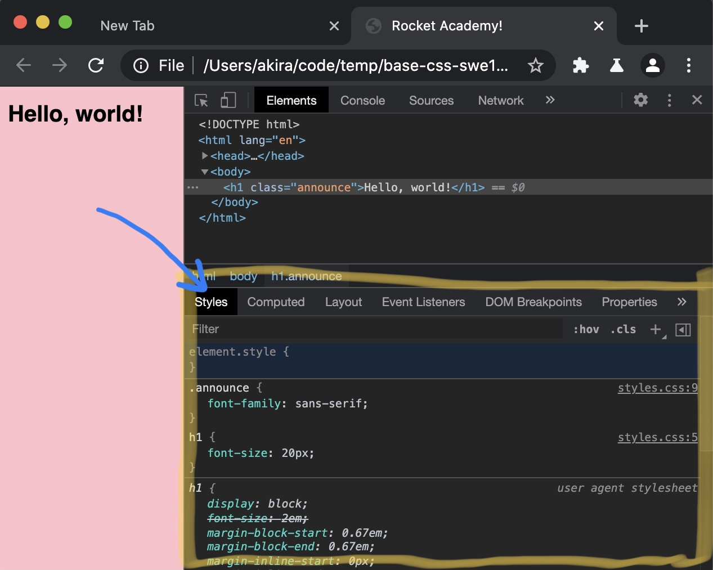
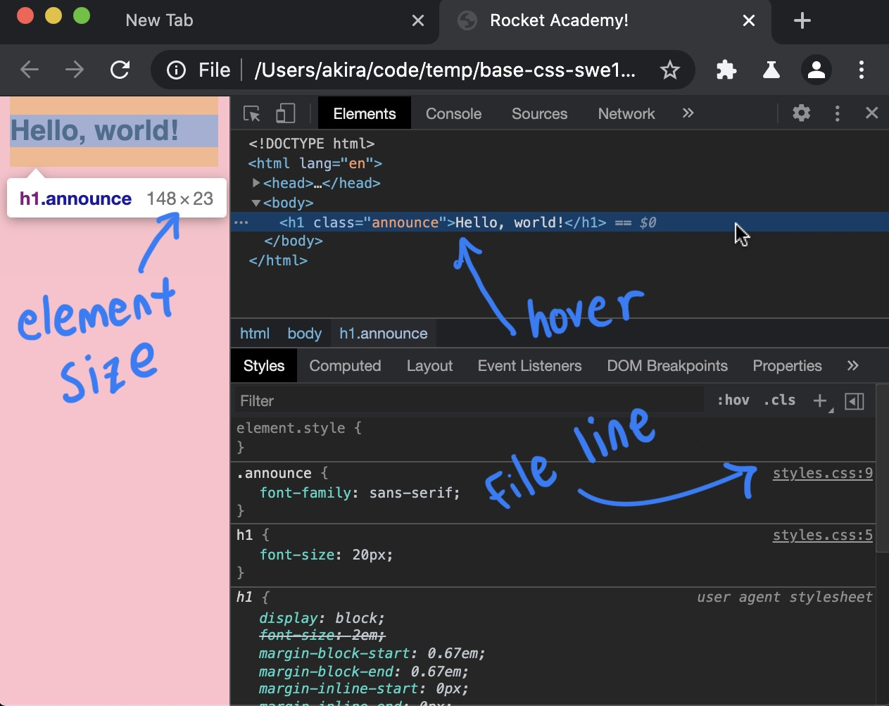
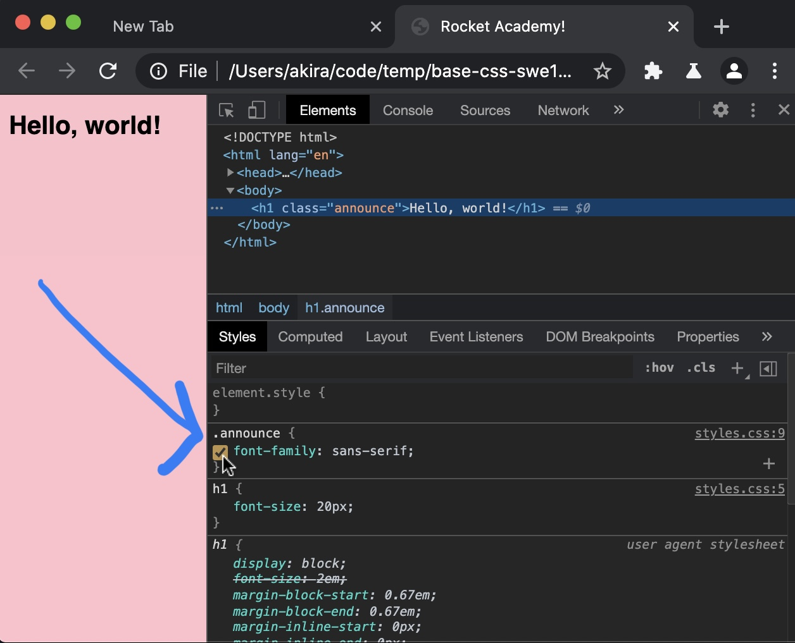
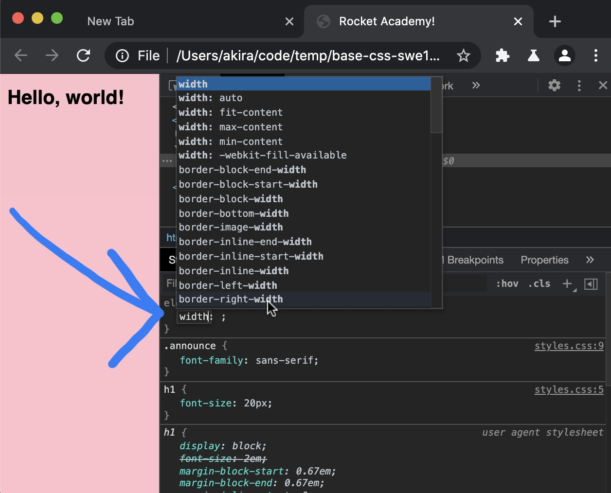

# 1.1.2: Basic CSS

## Introduction

We use CSS to style web pages. We will first learn how to apply styles to to HTML elements for basic formatting such as changing colours and sizes. We will later learn about CSS for layout.

## What is CSS

Built on top of HTML to add more visual control and complexity, CSS specifies _styles_ on an HTML element or set of elements. The CSS code specifies visual properties unrelated to the written content on an HTML page. In practice there are 2 uses for CSS: element styling and layout.

### **Element Styling**

CSS helps us change visual properties of HTML elements, such as fonts, background images, or rounded corners on buttons. Together with JS DOM manipulation, we can use CSS to implement visual logic within an application, such as hiding or showing cards and flipping elements 90 degrees.

### **Layout**

CSS can help us divide our UI into visual sections. This is one of the most tricky aspects of CSS, because CSS was not originally intended for layout design. CSS content in RA's Bootcamp will focus on implementing UI layouts.

## DevTools

A significant amount of CSS development happens in Chrome's DevTools. The Elements tab in DevTools is our primary tool to fine-tune and debug CSS.

### Styles Pane in Elements Tab



We saw how to inspect an element in [Module 1.1.1: Basic HTML](../1-frontend-basics/1.1-html/1.1.1-basic-html.md). When we select an HTML element in DevTools the CSS styles applied to that element appear in the Styles pane.

### Element / Style Inspection



Hovering over an HTML element in the HTML pane shows us style information like pixel dimensions of the element. The Styles pane shows us CSS precedence of styles on the element \(higher precedence on top\), and the CSS file name and line number where each style rule came from. In the above example, we see the styles for the `announce` class, the `h1` style from our CSS file, then the default `h1` browser \(user agent typically refers to the user's browser\) styles in decreasing order of precedence.

### Toggle Style



A checkbox will appear when we mouse over any style rule in the Styles pane. This toggles that style rule on and off.

### Edit CSS



We can edit CSS in the Styles pane for any HTML element to test styles on the current page. This is helpful for fine-tuning and debugging our CSS. Once we have found a set of styles that works, we can then write those styles in our CSS files in VSCode for more permanent storage. Changes we make to CSS in our browsers do not persist across page loads.

## Exercise Tips / Cheatsheet

### Don't Write Placeholder Text

Install the [Lorem Ipsum plugin for VSCode](https://marketplace.visualstudio.com/items?itemName=Tyriar.lorem-ipsum) to quickly get placeholder text.

### Get Placeholder Images for CSS

Use [Lorem Picsum](https://picsum.photos/) to get placeholder images.

### Use Readily-Available Icons

[Fontawesome](https://fontawesome.com/) makes it easy to put icons on a page using HTML elements and CSS. Read full Fontawesome documentation [here](https://fontawesome.com/how-to-use/on-the-web/referencing-icons/basic-use).

#### CSS styles link

```css
<link rel="stylesheet" href="https://stackpath.bootstrapcdn.com/font-awesome/4.7.0/css/font-awesome.min.css" crossorigin="anonymous">
```

#### Usage:

```css
<i class="fa fa-camera"></i>
```


Fontawesome docs may give examples where the icon base classes must change- `fas` might need to be changed to `fa` if the icon doesn't appear.


### Consider Using Google Fonts

Google's font collection is a relatively standard font collection of readable fonts. See their catalogue of fonts [here](https://fonts.google.com/) and an exercise on how to use Google fonts [here](https://www.freecodecamp.org/learn/responsive-web-design/basic-css/import-a-google-font). 

### Use Viewport Tag for Mobile Views \(Important!\)


Many students miss this, causing CSS layout issues in mobile views. Please add this to websites we want to work on mobile.


For mobile first layouts we need to add a scaling `meta` tag in our `head` tag. This is to develop for mobile on desktop without squinting. Chrome DevTools assumes we have this scaling tag when debugging mobile layouts. Read more about the `viewport` tag [here.](https://developer.mozilla.org/en-US/docs/Web/HTML/Viewport_meta_tag)

```markup
<meta name="viewport" content="width=device-width, initial-scale=1, shrink-to-fit=no">
```

## Exercises

We will complete the 44 exercises in [Free Code Camp's Basic CSS module](https://www.freecodecamp.org/learn/responsive-web-design/basic-css/).

### Part 1 \(Exercises 1-22\)

Complete Free Code Camp's Basic CSS Exercises 1-22. Start from [Change the Color of Text](https://www.freecodecamp.org/learn/responsive-web-design/basic-css/change-the-color-of-text) and end at [Use Clockwise Notation to Specify the Margin of an Element](https://www.freecodecamp.org/learn/responsive-web-design/basic-css/use-clockwise-notation-to-specify-the-margin-of-an-element).

### Part 2 \(Exercises 23-36, Skip Last 8 Exercises\)

Complete Free Code Camp's Basic CSS Exercises 23-36. Start from [Use Attribute Selectors to Style Elements](https://www.freecodecamp.org/learn/responsive-web-design/basic-css/use-attribute-selectors-to-style-elements) and end at [Use RGB to Mix Colors](https://www.freecodecamp.org/learn/responsive-web-design/basic-css/use-rgb-to-mix-colors). Skip last 8 exercises \(i.e. 37-44\) because they are not particularly relevant.

