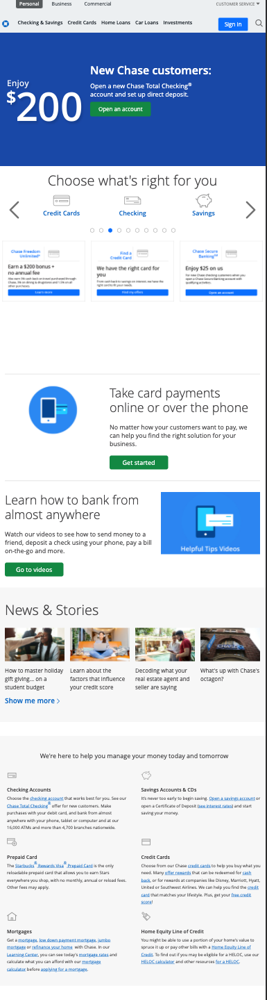
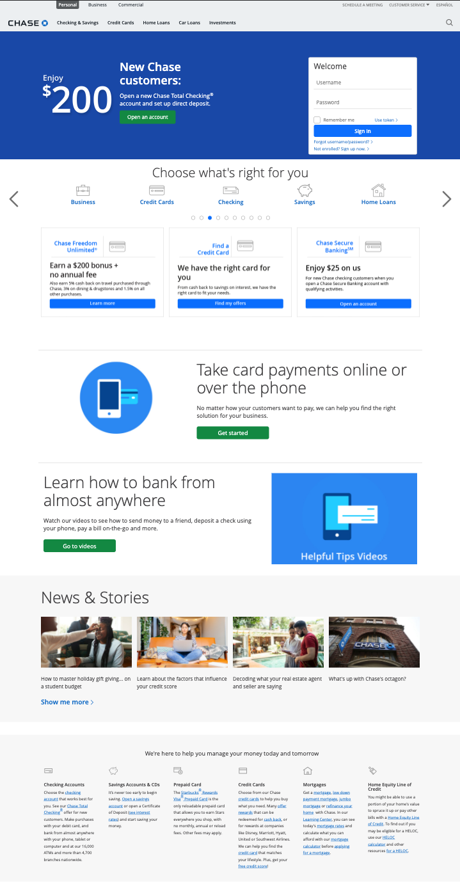

# CSS.ICE.8: Chase Bank

1. Clone RA's [Basic Bootstrap repo](https://github.com/rocketacademy/basic-bootstrap-bootcamp).
2. Use Bootstrap to recreate [Chase Bank's website](https://www.chase.com) using the following screenshots.
   1. Reminder to work on mobile view first.
3. Refer to RA's [CSS Cheatsheet](../css-1-basic-css.md#exercise-tips-cheatsheet) to make our job easier.

