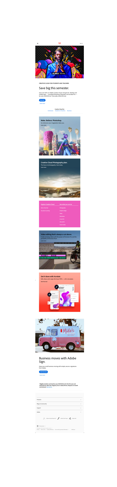
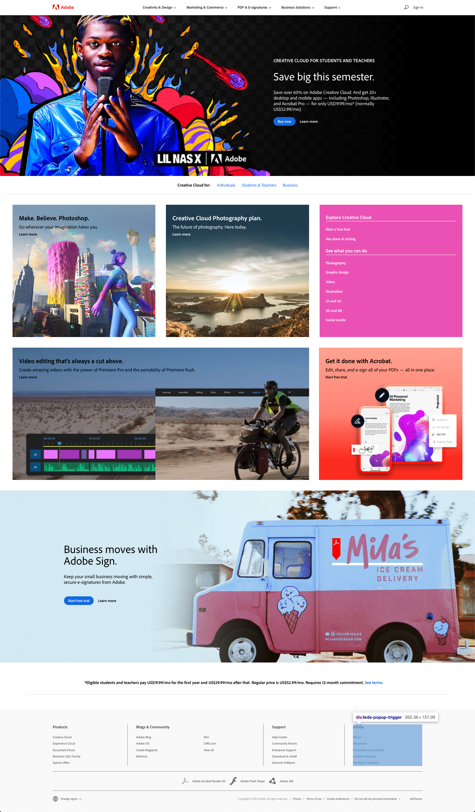

# 1.POCE.CSS.4: Bootstrap Adobe

## Instructions

1. Create a simplified version of the Adobe home page.
2. Create 2 responsive layouts, mobile and desktop. Make mobile first and desktop second. While building mobile layout, keep desktop layout in mind.
3. Feel free to replace images with text over them with solid-colour boxes with text over them. We are more concerned with the layout of the boxes for this exercise, not the images.

## Setup

1. Clone the Basic Bootstrap starter code [here](https://github.com/rocketacademy/basic-bootstrap-bootcamp).
2. Refer to the Bootstrap documentation website [here](https://getbootstrap.com/docs/4.6/getting-started/introduction/).

## Mobile Layout

## Desktop Layout

## Reference Solution

Click [here](https://github.com/rocketacademy/basic-bootstrap-bootcamp/tree/bootstrap-adobe) to see the reference solution for this post class.

