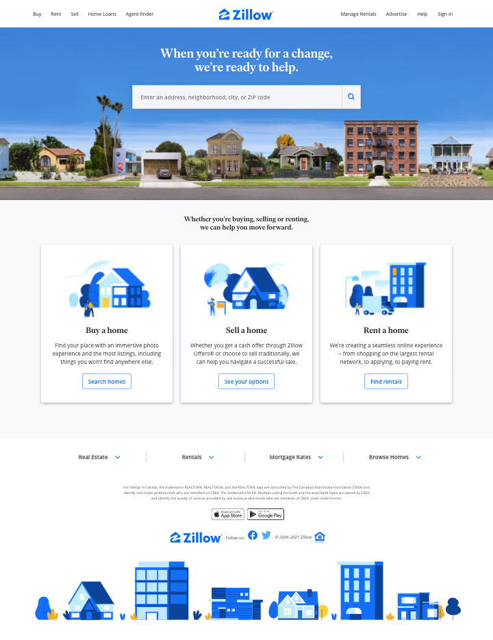

# CSS.ICE.7: Zillow

## Instructions

1. Clone Rocket's [Basic Bootstrap repo](https://github.com/rocketacademy/basic-bootstrap-bootcamp).
2. Use Bootstrap to recreate the real estate website [Zillow](https://www.zillow.com) using the following screenshots.
   1. Reminder to work on mobile view first.
3. Refer to Rocket's [CSS Cheatsheet](../css.1-basic-css/#exercise-tips-cheatsheet) to make our job easier.

