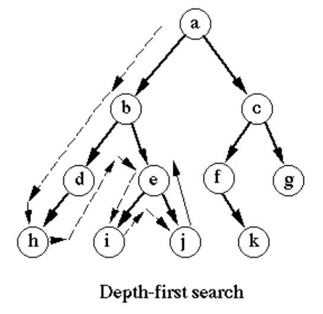

# D.10: Common Patterns

## Introduction

This module reviews common algorithmic patterns in DS&A interview problems.

## Trees

### Depth-First Search

Most vanilla recursion applies DFS. For example, the naive Fibonacci implementation of Fib\(n\) might solve the entire Fib\(n-1\) subtree before recursing on Fib\(n-2\).

The following is an example of DFS that returns true if the value `x` is within a tree, false if not.

```python
def find_x_in_tree(node, x):
  # If recursion reaches child of leaf node, x was not found
  if not node:
    return False
  # If current node has value x, x is found
  if node.val == x:
    return True
  # Return True if x is in the left or right subtrees
  return find_x_in_tree(node.left) or find_x_in_tree(node.right)
```


#### Exercises

1. [https://leetcode.com/problems/increasing-order-search-tree/](https://leetcode.com/problems/increasing-order-search-tree/)
   1. Hint: Consider in-order traversal to traverse a binary search tree in increasing order.
2. [https://leetcode.com/problems/maximum-depth-of-n-ary-tree/](https://leetcode.com/problems/maximum-depth-of-n-ary-tree/)
3. [https://leetcode.com/problems/maximum-depth-of-binary-tree/](https://leetcode.com/problems/maximum-depth-of-binary-tree/)
4. [https://leetcode.com/problems/leaf-similar-trees/](https://leetcode.com/problems/leaf-similar-trees/)
5. [https://leetcode.com/problems/convert-sorted-array-to-binary-search-tree/](https://leetcode.com/problems/convert-sorted-array-to-binary-search-tree/)
6. [https://leetcode.com/problems/flood-fill/](https://leetcode.com/problems/flood-fill/)
7. [https://leetcode.com/problems/same-tree/](https://leetcode.com/problems/same-tree/)
8. [https://leetcode.com/problems/minimum-distance-between-bst-nodes/](https://leetcode.com/problems/minimum-distance-between-bst-nodes/)
9. [https://leetcode.com/problems/binary-tree-paths/](https://leetcode.com/problems/binary-tree-paths/)
10. [https://leetcode.com/problems/binary-tree-tilt/](https://leetcode.com/problems/binary-tree-tilt/)
11. [https://leetcode.com/problems/symmetric-tree/](https://leetcode.com/problems/symmetric-tree/)
12. [https://leetcode.com/problems/balanced-binary-tree/](https://leetcode.com/problems/balanced-binary-tree/)
13. [https://leetcode.com/problems/path-sum/](https://leetcode.com/problems/path-sum/)

### Breadth-First Search

BFS is a fancier form of tree traversal that typically involves queues. 



As a recap of BFS, consider the following `level_order` traversal solution from [D.6.6: Trees](d.6-data-structures/d.6.6-trees.md#solutions), RA tree traversal exercises. The following algorithm enables us to access nodes in a tree in level order.

```python
def level_order(tree):
  ''' Return the list of values level by level (Hint: Consider iteration)'''
  level_order_values = []
  # Store upcoming nodes in a queue
  q = [tree]
  while len(q) > 0:
    # Iteratively dequeue first node in queue until queue is empty
    currnode = q.pop(0)
    # Perform operation on current node
    level_order_values.append(currnode.value)
    # Enqueue left child if any
    if currnode.left:
      q.append(currnode.left)
    # Enqueue right child if any
    if currnode.right:
      q.append(currnode.right)
  return level_order_values
```

#### Exercises

For each exercise, please answer why this is more efficiently solved with BFS than DFS. Consider using Python's built-in `deque` data structure [here](https://docs.python.org/3/library/collections.html#collections.deque) for a more efficient queue implementation than `list`. `deque` is implemented with a doubly-linked list, thus dequeue is a O\(1\) operation. Specifically, see the [`popleft` method](https://docs.python.org/3/library/collections.html#collections.deque.popleft).

1. [https://leetcode.com/problems/cousins-in-binary-tree/](https://leetcode.com/problems/cousins-in-binary-tree/)
   1. Rocket Academy solution code: [https://leetcode.com/submissions/detail/461981577/](https://leetcode.com/submissions/detail/461981577/)
   2. Rocket Academy video solution: [https://youtu.be/SeNfZBAU\_f4?t=4088](https://youtu.be/SeNfZBAU_f4?t=4088) \(1:08:08 onward\)
2. [https://leetcode.com/problems/symmetric-tree/](https://leetcode.com/problems/symmetric-tree/)
3. [https://leetcode.com/problems/minimum-depth-of-binary-tree/](https://leetcode.com/problems/minimum-depth-of-binary-tree/)
4. [https://leetcode.com/problems/employee-importance/](https://leetcode.com/problems/employee-importance/)
5. [https://leetcode.com/problems/binary-tree-right-side-view/](https://leetcode.com/problems/binary-tree-right-side-view/) \(Medium\)
6. [https://leetcode.com/problems/binary-tree-zigzag-level-order-traversal/](https://leetcode.com/problems/binary-tree-zigzag-level-order-traversal/) \(Medium\)

### Recursive Backtracking

Recursive backtracking means to explore all potentially valid recursive subtrees, and "backtrack" when we discover that a particular subtree is invalid or exhausted. In certain problems such as [Generate Parentheses](https://leetcode.com/problems/generate-parentheses/), this may mean we can avoid recursively exploring every subtree. In other problems such as [Permutations](https://leetcode.com/problems/permutations/), this may mean we explore every subtree, and "backtrack" when we have exhausted each subtree.

[This video](https://www.youtube.com/watch?v=gBC_Fd8EE8A) gives a simple explanation of the backtracking concept when applied to a maze problem, where our program "backtracks" each time it reaches a dead end. The code example is in Java, but we should be able to understand its logic. For a more detailed exploration of backtracking, consider the relevant Geeks for Geeks article [here](https://www.geeksforgeeks.org/backtracking-introduction/#:~:text=Backtracking%20is%20an%20algorithmic%2Dtechnique,reaching%20any%20level%20of%20the).

#### Sample Code Snippet

You have a set of tiles, where each tile has one letter tiles\[i\] printed on it.  Return the number of possible non-empty sequences of letters you can make.

Input: “AAB”, Output: 8. Explanation: "A", "B", "AA", "AB", "BA", "AAB", "ABA", "BAA".

```python
def numTilePossibilities(self, tiles: str):
    # Store the possible sequences in a set to ensure no duplicates
    sequences = set()
    
    # Perform depth-first search
    def find_possibilities(current, remaining):
        # If current is non-empty, it is a valid sequence.
        # Convert it to string and add to sequences.
        if current != []:
            sequences.add("".join(current))
            
        # If there are no letters remaining, we have exhausted all possible
        # sequences in this subtree and can return.
        if remaining == "":
            return
        
        # For each letter in remaining, add it to current and find
        # possibilities that start with letters in the new current.
        for i in range(len(remaining)): 
            current.append(remaining[i])
            find_possibilities(current, remaining[:i] + remaining[i+1:])
            # After finding possibilities for new current, reset current
            # by popping the last-added letter, before appending the next
            # letter in remaining. This is the backtracking step.
            current.pop() 
    
    # Kick off our search by providing an empty array for current and 
    # the original tiles string containing possible letters.
    find_possibilities([], tiles)
    
    # Return the number of unique sequences that we found from our search.
    return len(sequences)
```

#### Exercises

The following exercises are all Medium-level exercises on Leetcode. The Easy Leetcode backtracking problems weren't relevant.

1. [https://leetcode.com/problems/generate-parentheses/](https://leetcode.com/problems/generate-parentheses/)
   1. Hint: Consider [this slide](https://docs.google.com/presentation/d/1rpY5NnOvN7MKVLSI5NoU7LYySGVNRTC9Yptl9mtaXRY/edit#slide=id.g81c439b50b_0_93) on how we can prune invalid subtrees.
   2. Rocket Academy solution code: [https://leetcode.com/submissions/detail/462372077/](https://leetcode.com/submissions/detail/462372077/)
   3. Rocket Academy solution video: [https://youtu.be/MTqylosJ1ow?t=2022](https://youtu.be/MTqylosJ1ow?t=2022) until 57:25
2. [https://leetcode.com/problems/permutations/](https://leetcode.com/problems/permutations/)
3. [https://leetcode.com/problems/letter-case-permutation/](https://leetcode.com/problems/letter-case-permutation/)
4. [https://leetcode.com/problems/letter-combinations-of-a-phone-number/](https://leetcode.com/problems/letter-combinations-of-a-phone-number/)
5. [https://leetcode.com/problems/combination-sum/](https://leetcode.com/problems/combination-sum/)

## Arrays

### Binary Search

Consider the following canonical binary search implementation.

```python
def binarySearch(arr, x):
  # Initialise left and right bounds of search to start and end of arr
  l, r = 0, len(x) - 1
  # While l and r have yet to overlap
  while l <= r:
    # Find the midpoint between l and r
    mid = l + (r - l)//2
    # If the element at mid index is x, return mid
    if arr[mid] == x:
      return mid
    # Otherwise, if x is greater than elem at mid, update l to be 1 above mid
    elif arr[mid] < x:
      l = mid + 1
    # Otherwise, if x is less than elem at mid, update r to be 1 below mid
    else:
      r = mid - 1
  # If x is not found, return -1
  return -1
```

#### Exercises

1. [https://leetcode.com/problems/binary-search/](https://leetcode.com/problems/binary-search/)
2. [https://leetcode.com/problems/count-negative-numbers-in-a-sorted-matrix/](https://leetcode.com/problems/count-negative-numbers-in-a-sorted-matrix/)
3. [https://leetcode.com/problems/the-k-weakest-rows-in-a-matrix/](https://leetcode.com/problems/the-k-weakest-rows-in-a-matrix/)
4. [https://leetcode.com/problems/two-sum-ii-input-array-is-sorted/](https://leetcode.com/problems/two-sum-ii-input-array-is-sorted/)
5. [https://leetcode.com/problems/search-insert-position/](https://leetcode.com/problems/search-insert-position/)
6. [https://leetcode.com/problems/valid-perfect-square/](https://leetcode.com/problems/valid-perfect-square/)
7. [https://leetcode.com/problems/first-bad-version/](https://leetcode.com/problems/first-bad-version/)

### Sliding Window

Sliding window algorithms generally store a start and end index of a "window" in an array, and update that start and end index as we iterate through the array. See [this](https://levelup.gitconnected.com/an-introduction-to-sliding-window-algorithms-5533c4fe1cc7) explanation for an intro to sliding window algorithms. Use incognito mode to read the full article.

#### Exercises

The following exercises are Medium-level Leetcode exercises. There were no free Easy exercises.

1. [https://leetcode.com/problems/max-consecutive-ones-iii/](https://leetcode.com/problems/max-consecutive-ones-iii/)
2. [https://leetcode.com/problems/grumpy-bookstore-owner/](https://leetcode.com/problems/grumpy-bookstore-owner/)
3. [https://leetcode.com/problems/maximum-number-of-vowels-in-a-substring-of-given-length/](https://leetcode.com/problems/maximum-number-of-vowels-in-a-substring-of-given-length/)
4. [https://leetcode.com/problems/longest-repeating-character-replacement/](https://leetcode.com/problems/longest-repeating-character-replacement/)
5. [https://leetcode.com/problems/maximum-points-you-can-obtain-from-cards/](https://leetcode.com/problems/maximum-points-you-can-obtain-from-cards/)
6. [https://leetcode.com/problems/longest-turbulent-subarray/](https://leetcode.com/problems/longest-turbulent-subarray/)
7. [https://leetcode.com/problems/permutation-in-string/](https://leetcode.com/problems/permutation-in-string/)
8. [https://leetcode.com/problems/longest-continuous-subarray-with-absolute-diff-less-than-or-equal-to-limit/](https://leetcode.com/problems/longest-continuous-subarray-with-absolute-diff-less-than-or-equal-to-limit/)
9. [https://leetcode.com/problems/longest-substring-with-at-least-k-repeating-characters/](https://leetcode.com/problems/longest-substring-with-at-least-k-repeating-characters/)
10. [https://leetcode.com/problems/number-of-subsequences-that-satisfy-the-given-sum-condition/](https://leetcode.com/problems/number-of-subsequences-that-satisfy-the-given-sum-condition/)
11. [https://leetcode.com/problems/minimum-operations-to-reduce-x-to-zero/](https://leetcode.com/problems/minimum-operations-to-reduce-x-to-zero/)
12. [https://leetcode.com/problems/longest-substring-without-repeating-characters/](https://leetcode.com/problems/longest-substring-without-repeating-characters/)

### Bit Manipulation

Bit manipulation is commonly taught in core computer science courses to help students understand how numbers are represented and manipulated by computers. Some companies use bit manipulation in their interview processes.

1. Please read about the 6 main bitwise operators `&`, `|`, `~`, `^`, `<<`, and `>>` [here](https://code.tutsplus.com/articles/understanding-bitwise-operators--active-11301). These operators can be used in Python to perform bitwise operations.
2. Please read pages 124-128 on Bit Manipulation in [CTCI](d.0-module-d-overview.md#resources).

#### Exercises

1. [https://leetcode.com/problems/decode-xored-array/](https://leetcode.com/problems/decode-xored-array/)
2. [https://leetcode.com/problems/xor-operation-in-an-array/](https://leetcode.com/problems/xor-operation-in-an-array/)
3. [https://leetcode.com/problems/convert-binary-number-in-a-linked-list-to-integer/](https://leetcode.com/problems/convert-binary-number-in-a-linked-list-to-integer/)
4. [https://leetcode.com/problems/hamming-distance/](https://leetcode.com/problems/hamming-distance/)
5. [https://leetcode.com/problems/sort-integers-by-the-number-of-1-bits/](https://leetcode.com/problems/sort-integers-by-the-number-of-1-bits/)
   1. Consider using Python's built-in decimal to binary converter function `bin()`
6. [https://leetcode.com/problems/single-number/](https://leetcode.com/problems/single-number/)
   1. Requires trick to understand what happens when we XOR a number with 0, and when we XOR a number with itself
7. [https://leetcode.com/problems/number-complement/](https://leetcode.com/problems/number-complement/)
8. [https://leetcode.com/problems/binary-number-with-alternating-bits/](https://leetcode.com/problems/binary-number-with-alternating-bits/)
9. [https://leetcode.com/problems/power-of-two/](https://leetcode.com/problems/power-of-two/)
10. [https://leetcode.com/problems/reverse-bits/](https://leetcode.com/problems/reverse-bits/)
11. [https://leetcode.com/problems/power-of-four/](https://leetcode.com/problems/power-of-four/)

