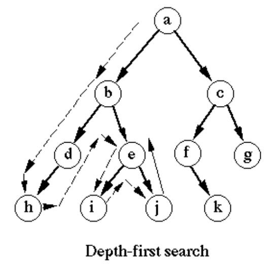

# D.5.6: Trees

## Introduction

Trees are a common data structure used to represent hierarchical data, often seen in DS&A problems. Trees are essentially linked lists where nodes are ordered from top to bottom instead of left to right, and each node can have more than 1 subsequent node, called **"child nodes"** in trees. Each child node can only have 1 **"parent node"**, and nodes with no child nodes are called **"leaf nodes"**. Nodes in trees generally contain a data payload \(e.g. a number\), and pointers to each respective child node.

## Helpful Resources

1. [This](https://www.youtube.com/watch?v=qH6yxkw0u78) video is a clear and concise intro to basic concepts regarding trees.
2. Read pages 112-115 in the [Cracking the Coding Interview PDF](../d.0-dsa-overview.md#resources).
3. [FTBC3's class video](https://youtu.be/3Dw3spVIk1w?t=297) when we introduced trees.

## Tree Traversals

The 2 most common methods of tree traversal are Depth-First Search \(DFS\) and Breadth-First Search \(BFS\). Tree traversal is a crucial technique in using trees to solve problems.

### Depth-First Search \(DFS\)


Most vanilla recursion applies DFS. For example, the naive Fibonacci implementation of Fib\(n\) might solve the entire Fib\(n-1\) subtree before recursing on Fib\(n-2\). The following is an example of DFS that returns `True` if the value `x` is within a tree, false if not.

```python
# The initial call to find_x_in_tree passes the root node
def find_x_in_tree(node, x):
  # If recursion reaches child of leaf node, x was not found
  if not node:
    return False
  # If current node has value x, x is found
  if node.val == x:
    return True
  # Return True if x is in the left or right subtrees of node
  return find_x_in_tree(node.left, x) or find_x_in_tree(node.right, x)
```

### Breadth-First Search \(BFS\)



BFS is a fancier form of tree traversal that typically involves queues. As a recap of BFS, consider the following `level_order` traversal solution from RA's tree traversal exercises. The following algorithm enables us to access nodes in a tree in level order.

Consider using Python's built-in `deque` data structure [here](https://docs.python.org/3/library/collections.html#collections.deque) for a more efficient queue implementation than `list`. `deque` is implemented with a doubly-linked list, thus dequeue is a O\(1\) operation. Specifically, see the [`popleft` method](https://docs.python.org/3/library/collections.html#collections.deque.popleft).

```python
from collections import deque

def level_order(root_node):
  ''' Return the list of values level by level (Hint: Consider iteration)'''
  level_order_values = []
  # Store upcoming nodes in a queue
  q = deque([root_node])
  while len(q) > 0:
    # Iteratively dequeue first node in queue until queue is empty
    currnode = q.popleft()
    # Perform operation on current node
    level_order_values.append(currnode.value)
    # Enqueue left child if any
    if currnode.left:
      q.append(currnode.left)
    # Enqueue right child if any
    if currnode.right:
      q.append(currnode.right)
  return level_order_values
```

### Pre-Order, In-Order and Post-Order Traversal

Certain tree problems are better solved if we can manipulate the order in which we traverse nodes. These 3 traversals are variations on the DFS algorithm shared above, and determine the order in which we traverse the left child, parent, and right child nodes. 

**Pre-Order Traversal** implies visiting nodes in the following order. This is helpful in situations such as searching a [binary search tree \(described below\)](d.5.6-trees.md#binary-search-trees).

1. Parent
2. Left Child
3. Right Child

**In-Order Traversal** implies visiting nodes in the following order. This is helpful in situations such as printing the values in a [binary search tree](d.5.6-trees.md#binary-search-trees) in ascending order.

1. Left Child
2. Parent
3. Right Child

**Post-Order Traversal** implies visiting nodes in the following order. This is helpful in situations where we might want to operate on all leaf nodes before their parents, for example when deleting nodes in a tree.

1. Left Child
2. Right Child
3. Parent

## Binary Search Trees

Binary Search Trees or BSTs are a special kind of tree where each node has the following properties.

1. All nodes in the left subtree \(subtree that extends from the parent node's left child\) have values smaller than the parent node.
2. All nodes in the right subtree \(subtree that extends from the parent node's right child\) have values larger than the parent node.

These properties are especially useful for search algorithms, because given relatively "balanced" BSTs we will be able to search for elements in BSTs in `O(log(n))` time. [Read more about BSTs here](https://www.geeksforgeeks.org/binary-search-tree-data-structure/).

## Use Cases

Trees are often used to represent hierarchical data, e.g. HTML elements or React components, and efficient use of trees can help us optimise our applications. Binary search trees are commonly used for indexing and lookup. Trees can also be used for efficient syntax parsing, for example in programming language compilation.

## General Tips for Problems

1. Tree \(and Linked List\) problems will often say that the tree is passed as a parameter to our function. What they mean by this is that the root or head node of the tree or linked list respectively is passed to the function. The tree is represented by the root node, which can be used to access all other nodes in the tree.

## Exercises

### Pre-Class

1. [https://repl.it/@kaiyuanneo/treeintro\#main.py](https://repl.it/@kaiyuanneo/treeintro#main.py)
   1. [https://repl.it/@kaiyuanneo/treeintrosoln\#main.py](https://repl.it/@kaiyuanneo/treeintrosoln#main.py)
   2. [FTBC3 class video ](https://youtu.be/3Dw3spVIk1w?t=3001)where we solved the 1st 2 problems together.
2. [https://repl.it/@kaiyuanneo/treebst\#main.py](https://repl.it/@kaiyuanneo/treebst#main.py)
   1. [https://repl.it/@kaiyuanneo/treebstsoln\#main.py](https://repl.it/@kaiyuanneo/treebstsoln#main.py)
3. [https://repl.it/@kaiyuanneo/treetraversals\#main.py](https://repl.it/@kaiyuanneo/treetraversals#main.py)
   1. Hint: Level-order traversal requires BFS techniques.
   2. [https://repl.it/@kaiyuanneo/treetraversals-soln\#main.py](https://repl.it/@kaiyuanneo/treetraversals-soln#main.py)

### Part 1

1. [https://leetcode.com/problems/univalued-binary-tree/](https://leetcode.com/problems/univalued-binary-tree/)
2. [https://leetcode.com/problems/search-in-a-binary-search-tree/](https://leetcode.com/problems/search-in-a-binary-search-tree/)
3. [https://leetcode.com/problems/maximum-depth-of-binary-tree/](https://leetcode.com/problems/maximum-depth-of-binary-tree/)
4. [https://leetcode.com/problems/maximum-depth-of-n-ary-tree/](https://leetcode.com/problems/maximum-depth-of-n-ary-tree/)
5. [https://leetcode.com/problems/minimum-depth-of-binary-tree/](https://leetcode.com/problems/minimum-depth-of-binary-tree/)

### Part 2

1. [https://leetcode.com/problems/same-tree/](https://leetcode.com/problems/same-tree/)
2. [https://leetcode.com/problems/binary-tree-paths/](https://leetcode.com/problems/binary-tree-paths/)
3. [https://leetcode.com/problems/path-sum/](https://leetcode.com/problems/path-sum/)
4. [https://leetcode.com/problems/minimum-absolute-difference-in-bst/](https://leetcode.com/problems/minimum-absolute-difference-in-bst/)
5. [https://leetcode.com/problems/two-sum-iv-input-is-a-bst/](https://leetcode.com/problems/two-sum-iv-input-is-a-bst/)

### Part 3

1. [https://leetcode.com/problems/sum-of-root-to-leaf-binary-numbers/](https://leetcode.com/problems/sum-of-root-to-leaf-binary-numbers/)
   1. Here's an [intuitive explanation of binary numbers](https://www.mathsisfun.com/binary-number-system.html).
   2. Kai also explained binary numbers in a [prior FTBC3 class here](https://youtu.be/qewAXA_vkpE?t=2372).
2. [https://leetcode.com/problems/increasing-order-search-tree/](https://leetcode.com/problems/increasing-order-search-tree/)
   1. Hint: Consider in-order traversal to traverse a binary search tree in increasing order.
3. [https://leetcode.com/problems/n-ary-tree-postorder-traversal/](https://leetcode.com/problems/n-ary-tree-postorder-traversal/)
4. [https://leetcode.com/problems/n-ary-tree-preorder-traversal/](https://leetcode.com/problems/n-ary-tree-preorder-traversal/)
5. [https://leetcode.com/problems/convert-sorted-array-to-binary-search-tree/](https://leetcode.com/problems/convert-sorted-array-to-binary-search-tree/)
   1. Hint: Consider starting in the middle of the array and using recursion.

### Part 4

1. [https://leetcode.com/problems/range-sum-of-bst/](https://leetcode.com/problems/range-sum-of-bst/)
   1. [Solution video](https://youtu.be/3Dw3spVIk1w?t=4579) from FTBC3's class
2. [https://leetcode.com/problems/merge-two-binary-trees/](https://leetcode.com/problems/merge-two-binary-trees/)
3. [https://leetcode.com/problems/invert-binary-tree/](https://leetcode.com/problems/invert-binary-tree/)
4. [https://leetcode.com/problems/average-of-levels-in-binary-tree/](https://leetcode.com/problems/average-of-levels-in-binary-tree/)
5. [https://leetcode.com/problems/leaf-similar-trees/](https://leetcode.com/problems/leaf-similar-trees/)

### Part 5

1. [https://leetcode.com/problems/cousins-in-binary-tree/](https://leetcode.com/problems/cousins-in-binary-tree/)
   1. Rocket Academy solution code: [https://pastebin.com/wWYXg309](https://pastebin.com/wWYXg309)
   2. Rocket Academy video solution: [https://youtu.be/SeNfZBAU\_f4?t=4088](https://youtu.be/SeNfZBAU_f4?t=4088) \(1:08:08 onward\)
2. [https://leetcode.com/problems/sum-of-left-leaves/](https://leetcode.com/problems/sum-of-left-leaves/)
3. [https://leetcode.com/problems/balanced-binary-tree/](https://leetcode.com/problems/balanced-binary-tree/)
4. [https://leetcode.com/problems/lowest-common-ancestor-of-a-binary-search-tree/](https://leetcode.com/problems/lowest-common-ancestor-of-a-binary-search-tree/)
5. [https://leetcode.com/problems/find-mode-in-binary-search-tree/](https://leetcode.com/problems/find-mode-in-binary-search-tree/)

### Part 6

1. [https://leetcode.com/problems/subtree-of-another-tree/](https://leetcode.com/problems/subtree-of-another-tree/)
2. [https://leetcode.com/problems/symmetric-tree/](https://leetcode.com/problems/symmetric-tree/)
3. [https://leetcode.com/problems/diameter-of-binary-tree/](https://leetcode.com/problems/diameter-of-binary-tree/)
4. [https://leetcode.com/problems/binary-tree-right-side-view/](https://leetcode.com/problems/binary-tree-right-side-view/) \(Medium\)
5. [https://leetcode.com/problems/binary-tree-zigzag-level-order-traversal/](https://leetcode.com/problems/binary-tree-zigzag-level-order-traversal/) \(Medium\)

