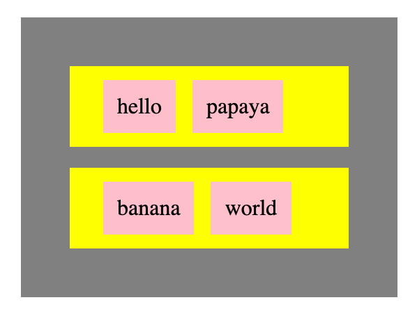

# Creating Elements

document gives the ability to create elements and put them on the screen.

### HTML Elements as JavaScript Variables



### Creating an Output

We can use the DOM to create elements and put them on the page.

```javascript
var coolParagraph = document.createElement('p');

coolParagraph.innerText = 'hey, cool!!!1!';
```

After we've created this element we need to tell the DOM to put it into the page.

```javascript
document.body.appendChild( coolParagraph );
```



**Start with this repo:** [**https://github.com/rocketacademy/swe101-next-steps-dom**](https://github.com/rocketacademy/swe101-next-steps-dom)\*\*\*\*

Copy this css into your `index.html`

\`\`

```css
.word {
  background-color: pink;
  margin: 0 4px;
  padding: 10px;
}

.row {
  background-color: yellow;
  margin: 15px;
  padding: 20px;
}

.container {
  background-color: grey;
  margin: 15px;
  padding: 20px;
  width: 230px;
}
```

Create this set of HTML elements on the page, using JavaScript:


```markup
<div class="container">
  <div class="row">
    <span class="word">hello</span>
    <span class="word">papaya</span>
  </div>
  <div class="row">
    <span class="word">banana</span>
    <span class="word">world</span>
  </div>
</div>
```

It should look something like this:




### Element Creation in a Loop

Write a loop so that you create 6 of these elements.

### Element Contents From an Array

```javascript
var words = ["banana","pasta","alligator","purple","accurate","fickle"];
```

Use this array to create the words in pink boxes. In this case, only create one yellow box.

### Element Contents From an Array of Arrays


```javascript
var words = [["orange","tomato"],["fire engine","basketball"]];
```


Use this structured array to create a series of yellow boxes. \(The food should be in one yellow box, and the objects in another yellow box\).

### Refactor

Create a function for the creation of each kind of box. Pass the contents of the box as a parameter.


